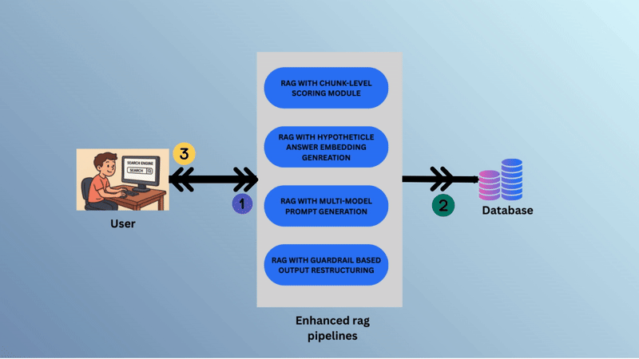

# MediRAG - A Medical Q&A System

## Overview

MediRAG is a research project focused on improving the reliability of **Medical Question & Answer (Q&A) systems** using **Retrieval-Augmented Generation (RAG)** pipelines. RAG, a compound AI system with a Large Language Model (LLM) at its core, has emerged as a popular approach for Q&A tasks due to its reduced hallucinations compared to standalone LLMs.  

Despite its advantages, current RAG systems are still prone to generating hallucinations, particularly when applied to specialized domains such as medicine. Our project aims to explore this limitation and develop optimized RAG pipelines tailored for medical disciplines.

---

## Background

RAG systems combine a **knowledge base** with an LLM to generate context-aware responses. While effective, existing solutions and improvements for reducing hallucinations are mostly **generic**, not domain-specific. This raises the question:

> Do the novel methods proposed in prior research maintain the same level of accuracy and hallucination reduction when applied to the medical domain?

MediRAG addresses this gap by designing **domain-optimized pipelines** to handle medical queries with higher reliability.

---

## Objectives

1. Investigate how existing hallucination mitigation methods perform in medical QA tasks.
2. Propose and implement **four RAG pipelines**, each targeting hallucination reduction in specific medical disciplines.
3. Evaluate and compare these pipelines to determine their effectiveness and reliability within the medical domain.

---

## Why Four Pipelines?

The medical domain is vast and linguistically diverse. A single pipeline may not sufficiently capture nuances across disciplines. MediRAG uses **four specialized pipelines**, each optimized for one or more related medical disciplines. This modular design allows focused improvements while reusing pipelines for disciplines with similar language structures.

---

## Proposed RAG Pipelines

1. **Chunk-Level Scoring RAG**
   - Incorporates a **domain-specific scoring module** to evaluate knowledge chunks.
   - Ensures the most relevant medical information is prioritized during response generation.

2. **Hypothetical-Answer Embedding RAG**
   - Generates a **hypothetical answer** and matches it with chunk embeddings.
   - Improves alignment between retrieved knowledge and generated responses.

3. **Dynamic Prompt RAG**
   - Updates the **prompt dynamically** based on context retrieved.
   - Adjusts instructions to the LLM in real-time for more accurate, context-aware answers.

4. **Regeneration RAG with Critical-Word Flagging**
   - Detects potentially false or misleading responses using **flagged critical words**.
   - Regenerates answers if flagged content is too frequent, reducing hallucinations.

---

## High-Level System Overview

Below is a **simplified flow of MediRAG**:

