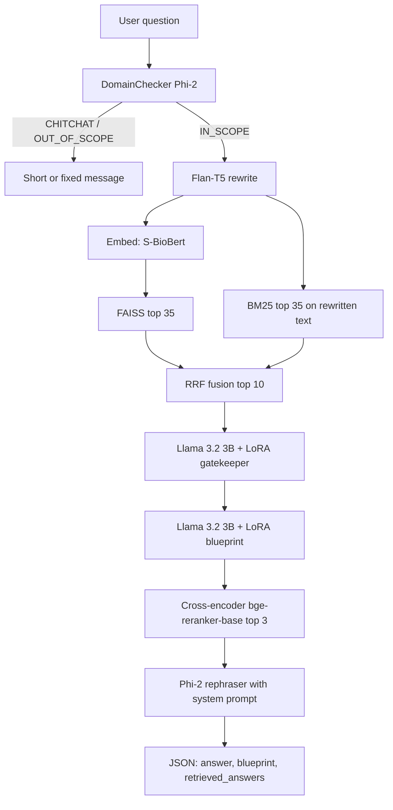

# MediRAG: Neurosciences (Neurology) — end-to-end documentation

This document describes the **full path from data → indices → models → API → UI** for the **Neurosciences** track: **`backend/neurology`** (FastAPI on port **8000**) and the **Next.js** frontend (cluster **1**).

---

## 1) Purpose and scope

The Neurosciences pipeline answers questions about **neurology and neurosurgery** using **retrieval-augmented generation (RAG)**. It is designed to:

- Restrict off-topic and casual input before retrieval (**intent / domain gating**).
- Retrieve evidence with **hybrid** dense + sparse search and **RRF** fusion.
- **Filter** retrieved chunks with a **fine-tuned SLM (LoRA gatekeeper)**.
- **Plan** what a good answer should cover via a second **LoRA (blueprint)**.
- **Re-rank** surviving chunks with a **cross-encoder** using that blueprint.
- **Synthesize** a grounded answer with **Microsoft Phi-2** using a strict **evidence-only** system prompt.

---

## 2) Research data pipeline (before the backend runs)

### 2.1 Source dataset

- The research workflow starts from HuggingFace **`miriad/miriad-4.4M`** (MIRIAD 4.4M medical QA).
- The repository’s **`data division logic/cluster_division.ipynb`** (see also `specialties.py`) can:
  - Stream or process the full dump (e.g. to `miriad_4.4M.jsonl`).
  - **Filter** rows to specialties **`Neurology`** and **`Neurosurgery`**, producing artifacts such as **`miriad_neurology.jsonl`** and **`miriad_neurology.json`**.

*Building the FAISS/BM25 files from that JSON is not fully scripted inside `backend/neurology` in this repository; the backend expects **pre-built** `data/*` indices under `backend/neurology/data/` (see Section 6).*

---

## 3) Backend service overview

- **Service:** FastAPI app in `backend/neurology/main.py`
- **Default port:** `8000`
- **Main endpoint:** `POST /query`
- **CORS:** Allows local dev origins including `http://localhost:3000` (see `main.py`).

**Startup (lifespan):** loads two heavy subsystems once:

1. **Phi-2** (`SharedPhiManager`) — shared by **domain / chitchat** handling and the **final answer rephraser**.
2. **Llama 3.2 3B Instruct** + two **LoRA adapters** (`SharedSLMManager`) — shared by **gatekeeper** and **blueprint** (switched with `set_adapter`).

---

## 4) Request / response contract

### 4.1 `POST /query`

**Request body (JSON):**

```json
{ "question": "<user question string>" }
```

**Response (JSON) — main fields** (`main.py`):

| Field | Meaning |
|--------|---------|
| `question` | Echo of the user question |
| `blueprint` | List of strings: clinical “requirements” for a good answer (from SLM + blueprint LoRA) |
| `answer` | Final text from **Phi-2** (`LLMRephraser`) |
| `retrieved_answers` | Top chunks after **reranking** (evidence used for the final step) |

**Early exits (no full RAG):**

- **Chitchat:** `DomainChecker` returns only `question` and `answer` (friendly reply).
- **Out of scope:** fixed multi-line disclaimer (`OUT_OF_SCOPE_MESSAGE` in `main.py`).

---

## 5) End-to-end inference pipeline (every stage)

The order in `query_rag()` is:

### Stage A — Intent / domain (Phi-2, no extra LoRA)

- **`DomainChecker`** (`models/domain_checker.py`) calls **`classify_intent`**: Phi-2 must output a single word — **`IN_SCOPE`**, **`OUT_OF_SCOPE`**, or **`CHITCHAT`**.
- On failure, it **fails open** to **`IN_SCOPE`** (proceeds with RAG).
- Chitchat uses a separate small Phi-2 prompt with **temperature 0.7** for a short friendly reply.

**Models involved:** `microsoft/phi-2` via `SharedPhiManager` (4-bit on CUDA when enabled).

---

### Stage B — Query rewriting (Flan-T5, local)

- **`QueryRewriter`** loads a **local** directory (not a Hub id in code): `model_weights/flan_t5_neuro_rewriter`.
- It uses **`AutoTokenizer` + `AutoModelForSeq2SeqLM`**, `generate` with `max_length=64`, `num_beams=4`.
- **Purpose:** produce a **rewritten** query string used for **lexical (BM25)** retrieval only (the dense path uses the **original** user question for embedding—see next stage).

**Artifact:** fine-tuned **Flan-T5** checkpoint at `model_weights/flan_t5_neuro_rewriter` (path from `config.QUERY_REWRITER_DIR`).

---

### Stage C — Dense query embedding (Sentence-Transformers)

- **`Embedder`** (`models/embedder.py`) uses **Sentence-Transformers** with:
  - **`EMBEDDING_MODEL_NAME` = `pritamdeka/S-BioBert-snli-multinli-stsb`**
  - Encodes the **original** `user_query` (list of one string), **`normalize_embeddings=True`**.
- Auth: constructor passes `HF_TOKEN` (same env as `SLM1_HF_TOKEN` in `main.py`) for Hugging Face if needed.

**This is the embedding model for FAISS:** the index must have been built in the **same** embedding space as this model.

---

### Stage D — Hybrid retrieval

1. **FAISS (dense):** `FaissRetriever` — loads `data/faiss.index` and `data/metadata.pkl`. Search uses the query embedding; returns chunks with `faiss_rank`, `faiss_score`.
2. **BM25 (sparse):** `BM25Retriever` — loads `data/bm25.pkl` + same metadata. Tokenizes the **rewritten** query with NLTK `word_tokenize` (with `punkt_tab` data).
3. **Fusion:** `rrf_fusion()` in `retrieval/hybrid_rrf.py` — **Reciprocal Rank Fusion (RRF)** with constant **`RRF_K = 60`**, merging lists keyed by `qa_id`.
4. **Cap:** `FINAL_TOP_K = 10` chunks after RRF.

**Tuning in `config.py`:** `FAISS_TOP_K = 35`, `BM25_TOP_K = 35`, `FINAL_TOP_K = 10`.

---

### Stage E — SLM gatekeeper (Llama 3.2 3B + LoRA `gatekeeper`)

- **`SLMGatekeeper`** (`models/slm_gatekeeper.py`) sets the shared PEFT model to adapter **`"gatekeeper"`** (`SharedSLMManager.set_adapter`).

**Base model (Hub):** `meta-llama/Llama-3.2-3B-Instruct`  
**Adapter on disk:** `model_weights/slm1_lora_adapter_2` (PEFT, adapter name in memory: `gatekeeper`)

- For **each** fused chunk, it builds a chat-formatted prompt (system: constraint-aware **PASS/FAIL** JSON; user: query + “Target Chunk” = chunk `answer`).
- Generation: `max_new_tokens=256`, greedy.
- Expects **JSON** with a `"label"` of **PASS** or **FAIL**; misparsed output falls back to heuristics; only **PASS** chunks are kept.
- **Fail-open:** on exception, **all chunks** are returned unfiltered.

**HF auth:** `HF_TOKEN` for base Llama and adapter load (`SharedSLMManager` calls `huggingface_hub.login`).

---

### Stage F — Blueprint generator (same base model + LoRA `blueprint`)

- **`SLMBlueprintGenerator`** (`models/slm_blueprint.py`) sets adapter **`"blueprint"`**.

**Adapter on disk:** `model_weights/slm2-lora-adapter` (adapter name: `blueprint`)

- System prompt: senior neurologist/neurosurgeon; output **3–4** ordered requirements as **valid JSON** including a **`blueprint`** array.
- Parsed result is a **`List[str]`**; on parse failure or empty list, a **single fallback** requirement string is used.

---

### Stage G — Instruction-following re-ranker (cross-encoder, not fine-tuned in-repo)

- **`InstructionReranker`** (`models/instruction_reranker.py`) — lazy-loads a **`CrossEncoder`**.
- **Model name from `config`:** `RERANKER_MODEL_NAME = "BAAI/bge-reranker-base"` (the class may mention other defaults; **runtime** follows `config.py`).
- **Top-K:** `RERANKER_TOP_K = 3` chunks passed to the final LLM.
- It builds a **“super_query”** = blueprint text + user query, pairs each chunk’s **`answer`** with that super-query, `predict`s scores, sorts descending, takes top 3.
- On ranking failure, returns the first `top_k` original chunks (unordered scores).

---

### Stage H — Final answer “rephraser” (Phi-2 + system prompt)

- **`LLMRephraser`** (`models/llm_rephraser.py`) uses the same **`SharedPhiManager`** (Phi-2) as the domain checker.
- It concatenates:
  - Full text of **`prompts/system_prompt.py`** — **strict**: only neurology/neurosurgery, only from retrieved answers, no external medical knowledge, explicit decline if insufficient evidence.
  - The user **question** and a bullet list of **“Retrieved Answers”** (each item is chunk **`answer`**).
- **`generate`:** `max_new_tokens=512`, `temperature=0.0` (greedy / deterministic).

This is the **final answer rephraser** in the codebase: **Microsoft Phi-2** with a **static** evidence-bound system prompt, **not** a separate fine-tuning step in-repo.

---

## 6) On-disk artifacts (neurology backend)

Paths are relative to `backend/neurology/` unless stated.

| Path / pattern | Role |
|----------------|------|
| `data/faiss.index` | FAISS index (must match S-BioBERT ST embedding space) |
| `data/bm25.pkl` | Pickled BM25 index |
| `data/metadata.pkl` | Aligned document metadata; merged into retrieval results; keyed by `qa_id` for RRF |
| `model_weights/flan_t5_neuro_rewriter/` | **Fine-tuned** Flan-T5 (seq2seq) for **query rewrite** (local `from_pretrained` dir) |
| `model_weights/slm1_lora_adapter_2/` | **LoRA** for **gatekeeper** (PEFT) |
| `model_weights/slm2-lora-adapter/` | **LoRA** for **blueprint** (PEFT) |

*These directories are typically **gitignored**; you supply them in your environment.*

**Downloaded at runtime (not stored under `model_weights` by default):**

- `pritamdeka/S-BioBert-snli-multinli-stsb` (embeddings) — HF cache
- `microsoft/phi-2` — HF cache
- `meta-llama/Llama-3.2-3B-Instruct` + bitsandbytes 4-bit when on CUDA — HF cache
- `BAAI/bge-reranker-base` — HF cache (first rerank use)

---

## 7) Configuration reference (`backend/neurology/config.py`)

| Symbol | Value / role |
|--------|----------------|
| `FAISS_INDEX_PATH`, `BM25_INDEX_PATH`, `METADATA_PATH` | `data/...` paths |
| `EMBEDDING_MODEL_NAME` | `pritamdeka/S-BioBert-snli-multinli-stsb` |
| `QUERY_REWRITER_DIR` | `model_weights/flan_t5_neuro_rewriter` |
| `PHI_MODEL_NAME` | `microsoft/phi-2` |
| `FORCE_GPU` | If `True` and no CUDA, **process exits** (see `SharedSLMManager` / `SharedPhiManager`) |
| `USE_4BIT_QUANTIZATION` | 4-bit loading for Phi and SLM on CUDA |
| `SLM1_BASE_MODEL` | `meta-llama/Llama-3.2-3B-Instruct` (shared base; **both** LoRAs attach to this) |
| `SLM1_ADAPTER_PATH` | gatekeeper LoRA path |
| `SLM2_ADAPTER_PATH` | blueprint LoRA path |
| `SLM1_HF_TOKEN` | `os.environ["HF_TOKEN"]` for gated models and login |
| `RERANKER_MODEL_NAME` | `BAAI/bge-reranker-base` |
| `RERANKER_TOP_K` | `3` |
| `FAISS_TOP_K` / `BM25_TOP_K` | `35` / `35` |
| `FINAL_TOP_K` | `10` (after RRF, before gate) |
| `RRF_K` | `60` |

---

## 8) How models relate (summary table)

| Component | Model / artifact | Modality | Fine-tuning in repo |
|------------|-------------------|----------|------------------------|
| Intent + chitchat | `microsoft/phi-2` | Causal LM | No (prompt-only) |
| Out-of-scope message | Fixed string | N/A | N/A |
| Query rewrite | Local **Flan-T5** dir | Seq2seq | Weights are **local**; training not in this folder |
| Dense retrieval | `pritamdeka/S-BioBert-snli-multinli-stsb` | ST embeddings | Hub base; **index** must be consistent |
| Lexical retrieval | BM25 over indexed corpus | Sparse | N/A |
| Gatekeeper | **Llama 3.2 3B** + **LoRA** `slm1_lora_adapter_2` | Causal + PEFT | LoRA is **local artifact** |
| Blueprint | **Same Llama 3.2 3B** + **LoRA** `slm2-lora-adapter` | Causal + PEFT | LoRA is **local artifact** |
| Reranker | `BAAI/bge-reranker-base` | Cross-encoder | Hub; not neuro-fine-tuned in code |
| Final answer | `microsoft/phi-2` + `prompts/system_prompt.py` | Causal LM | No LoRA; **prompt-constrained** synthesis |

---

## 9) Python dependencies and runbook

- **`backend/neurology/requirements.txt`**: FastAPI, uvicorn, transformers, sentence-transformers, `faiss-cpu`, `rank-bm25`, `nltk`, `peft`, `bitsandbytes`, etc. **PyTorch** is expected to be installed **with CUDA** per comments at top of the file.
- **GPU check:** `python check_gpu.py` in `backend/neurology/`.
- **Run:** `uvicorn main:app --host 0.0.0.0 --port 8000` (see `README_QUICKSTART.md` at repository root).
- **Docker:** `backend/neurology/Dockerfile` — CUDA base image, pre-downloads NLTK `punkt_tab`, `HF_HOME` for RunPod-style volumes, **single worker** to avoid duplicating model loads.
- **Environment:** set **`HF_TOKEN`** for Llama, LoRA loading, and any private/gated Hub resources.

**Commented code:** `main.py` includes a **large commented** `chunkrag/detailed` pipeline that would expose **per-stage** JSON for demos (not active).

---

## 10) Frontend: Neurosciences user flow

### 10.1 Where it lives

- **Chat UI and routing:** `frontend/src/app/chat/page.tsx`
- **Cluster 1 (Neurosciences) copy:** `frontend/src/components/ChatArea/ChatArea.tsx` and landing copy in `frontend/src/app/landing/content.ts`.

### 10.2 Routing

- **Cluster 1** maps to:
  - **URL:** `http://127.0.0.1:8000/query`
  - **Body:** `{ "question": "<q>" }`

(Defined in `BACKEND_URL_BY_CLUSTER` and `REQUEST_BODY_BY_CLUSTER` in `page.tsx`.)

### 10.3 Response handling

- For clusters **other than 4**, the UI uses: `data.answer || data.direct_answer` — for Neurosciences that is **`answer`**.
- The backend also returns `blueprint` and `retrieved_answers`; the default chat UI does not surface them; they are available for debugging, demos, or a future “evidence” panel.

### 10.4 Auth and persistence

- The page uses **NextAuth**; saving to MongoDB is gated on authenticated users (`persistExchange`, `/api/conversations/...`). That is **orthogonal** to the neurology RAG API.

---

## 11) Gaps and explicit “not in this repository” items

- **FAISS/BM25 build scripts** for neurology are **not** included as a single turnkey script under `backend/neurology/`. You must have **`data/faiss.index`**, **`bm25.pkl`**, and **`metadata.pkl`** prepared consistently with **S-BioBERT** embeddings and your QA schema (`qa_id`, `answer`, etc.).
- **Training recipes** for `flan_t5_neuro_rewriter` and the two **Llama 3.2 3B LoRAs** are **not** defined in the neurology folder; the code assumes **ready-made** weights at the paths in `config.py`.
- If you need **line-level citations** or UI display of `retrieved_answers` / `blueprint`, that is a **frontend extension**; the API already returns them.

---

## 12) Flowchart (mental model)


